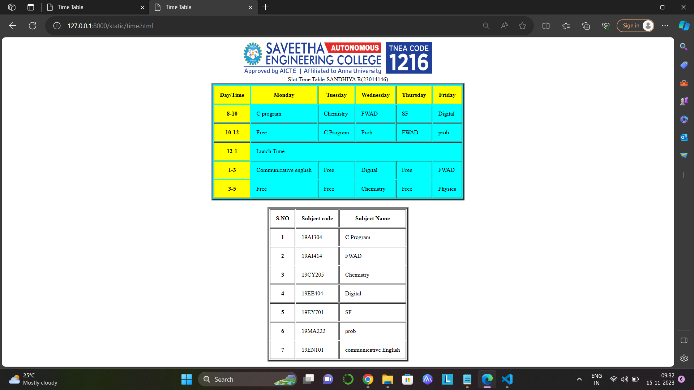

# Ex03 Time Table
## Date:09.11.2023

## AIM
To write a html webpage page to display your slot timetable.

## ALGORITHM
### STEP 1
Create a Django-admin Interface.

### STEP 2
Create a static folder and inert HTML code.

### STEP 3
Create a simple table using ```<table>``` tag in html.

### STEP 4
Add header row using ```<th>``` tag.

### STEP 5
Add your timetable using ```<td>``` tag.

### STEP 6
Execute the program using runserver command.

## PROGRAM
```
<html>
     <title>Time Table</title>
     <body>
     <center>
           <table border="5" bgcolor="cyan" cell spacing="10" cellpadding="15">
          
           <caption>Slot Time Table-SANDHIYA R(23014146)</caption>
            
<tr>
    <TR bgcolor="Yellow">
    <th>Day/Time</th>
    <th>Monday</th>
    <th>Tuesday</th>
    <th>Wednesday</th>
    <th>Thursday</th>
    <th>Friday</th>
    </TR>
</tr>
<tr>
   <th bgcolor="yellow">8-10</th>
   <td>C program</td>
   <td>Chemistry</td>
   <td>FWAD</td>
   <td>SF</td>
   <td>Digital</td>
</tr>
<tr>
   <th bgcolor="yellow">10-12</th>
   <td>Free</td>
   <td>C Program</td>
   <td>Prob</td>
   <td>FWAD</td>
   <td>prob</td>
</tr>
<tr>
    <th bgcolor="yellow">1-3</th>
   <td>Communicative english</td>
   <td>Free</td>
   <td>Digital</td>
   <td>Free</td>
   <td>FWAD</td>
</tr>
<tr>
   <th bgcolor="yellow">3-5</th>
   <td>Free</td>
   <td>Free</td>
   <td>Chemistry</td>
   <td>Free</td>
   <td>Physics</td>
</tr>
</table>
<br>
<table>
 <table border="5" cell spacing="10" cellpadding="15">
<tr>
   <th>S.NO</th>
   <th>Subject code</th>
   <th>Subject Name</th>
</tr>
<tr>
   <th>1</th>
   <td>19AI304</td>
   <td>C Program</td>
</tr>
<tr>
   <th>2</th>
   <td>19AI414</td>
   <td>FWAD</td>
</tr>
<tr>
   <th>3</th>
   <td>19CY205</td>
   <td>Chemistry</td>
</tr>
<tr>
   <th>4</th>
   <td>19EE404</td>
   <td>Digital</td>
</tr>
<tr>
   <th>5</th>
   <td>19EY701</td>
   <td>SF</td>
</tr>
<tr>
   <th>6</th>
   <td>19MA222</td>
   <td>prob</td>
</tr>
<tr>
   <th>7</th>
   <td>19EN101</td>
   <td>communicative English</td>
</tr>
</table>
</body>
</center>
</html>
```

## OUTPUT


## RESULT
The program for creating slot timetable using basic HTML tags is executed successfully.
